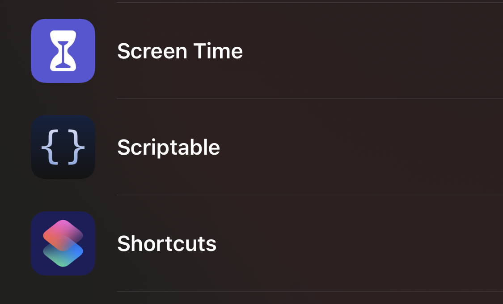
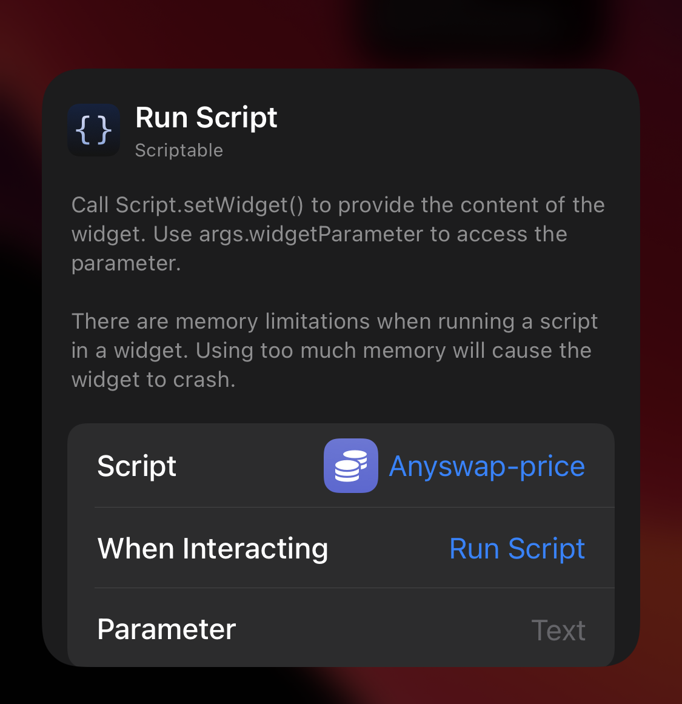

# Anyswap iOS Widget  Inspired by [Fear and Greed iOS Widget](https://alternative.me/crypto/fear-and-greed-index/)

## Download scriptable app

### 1. Copy script from file (/anyswap-price.js)
 

### 2. Open the scriptable app.

  

### 3. Click on the "+" symbol in the upper right corner and paste the copied script (tapping twice on the same place in the text field opens an overlay that allows pasting from the clipboard).

  

### 4. Click on the title of the script at the top and give it a name (e.g. Anyswap-price).

  

### 5. Save the script by clicking on "Done" in the upper left.
 

### 6. Go to your iOS home screen and press anywhere to enter "wiggle mode" (which also allows you to arrange the app icons).

  

### 7. Press the "+" symbol in the top left corner, then scroll down to "Scriptable" or search for it.

  

### 8. Select the first widget size (small) and press "Add Widget" at the bottom.

  

### 9. Press the widget to edit its settings, under "Script" select the one you created above (Anyswap-price).

  

### TIPS: Stack multiple widgets

## Now you got the nice Widget, enjoy! 🚀
